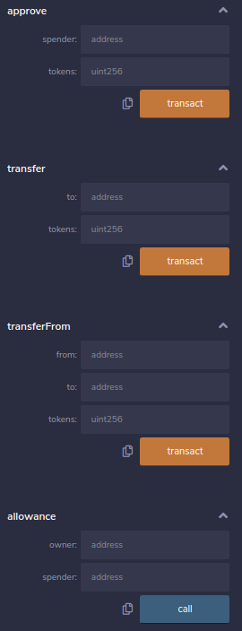
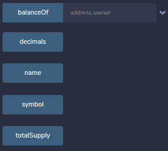

# Kudos ERC20 Token
> Kudos is a simple ERC20 token developed for the ADSB course at OST university of applied sciences.

- [Kudos ERC20 Token](#kudos-erc20-token)
  - [Quickstart](#quickstart)
  - [Requirements](#requirements)
  - [Frontend](#frontend)
    - [Tools](#tools)
  - [Kudos (KDS) Contract](#kudos-kds-contract)
    - [Development](#development)
    - [Contract Methods](#contract-methods)

## Quickstart
* Install the MetaMask browser extension ([Firefox](https://addons.mozilla.org/en-US/firefox/addon/ether-metamask/), [Chrome](https://chrome.google.com/webstore/detail/metamask/nkbihfbeogaeaoehlefnkodbefgpgknn))
* Create an account and log in
* Select the **Ropsten** test network
* Add the Kudos (KDS) Token (*Add Token* -> *Custom Token* -> `0xe2e2f6881c20c873d8e53e21ba942f865e25561a`)

```shell
git clone https://github.com/catreadme/kudos-token.git
cd kudos-token
docker-compose up --build -d --scale kudos=3
```

* Visit [localhost:3000](http://localhost:3000/)
* Connect your wallet to the application (the MetaMask extension popup should appear)

## Requirements
1. Public blockchain based -> Check, runs on ethereum blockchain, see `./contract`
2. Fully decentralized **or** scalable mechanism ready to be deployed on the cloud -> Check, uses `traefic` and `docker-compose --scale` for easy scalability
3. Graphical GUI -> Check, see `./frontend`

## Frontend
The frontend acts as the "**wallet**" and has the following features:
* **View Account Balance** (Can be used to retrieve *own* balance or someone else's)
* **Do a transaction** (Can send KDS Tokens to somebody)
* **View transaction history** (From own account)
* **Approve an amount to spend to a different wallet** (Allow a different wallet to spend tokens for you)
* **Check allowance from another wallet** (Check how many tokens you are allowed to spend from a different wallet)
* **Do a transaction from another wallet** (Send tokens to a wallet, taking the amount from a different one than yours)

### Tools
* [web3.js](https://web3js.readthedocs.io/en/v1.2.0/web3-eth-contract.html) for handling the contract interaction
* [Etherscan API](https://ropsten.etherscan.io/apis) for getting the transaction history

## Kudos (KDS) Contract
* `./contract/KDSToken.sol`: Token contract
* `./contract/IERC20.sol`: Interface conforming to the [ERC20 specification](https://eips.ethereum.org/EIPS/eip-20)
* `./contract/SafeMath.sol`: [Library](https://github.com/OpenZeppelin/openzeppelin-contracts/blob/9b3710465583284b8c4c5d2245749246bb2e0094/contracts/math/SafeMath.sol) taken from [OpenZeppelin Contracts](https://github.com/OpenZeppelin/openzeppelin-contracts)

### Development
* Copy `.sol` files into the [remix online ide](https://remix.ethereum.org/)
* Compile
* Deploy to JS VM for testing
* Deploy to test network
  * **Ropsten**: [Kudos Contract](https://ropsten.etherscan.io/token/0xe2e2f6881c20c873d8e53e21ba942f865e25561a)

### Contract Methods
* Purpose and usage are explained in the [ERC20 specification](https://eips.ethereum.org/EIPS/eip-20)  
* Can be manually tested conveniently inside [remix](https://remix.ethereum.org/) (Deploy to JS VM)

  


